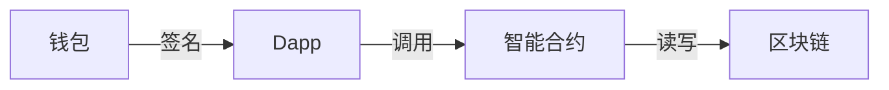

# BBBINGW

**GitHub ID:** BBBINGW

**Telegram:** 

## Self-introduction

Web3 暑期实习计划 - Monad Buidler Camp

## Notes

<!-- Content_START -->
# 2026-07-06
<!-- DAILY_CHECKIN_2026-07-06_START -->
# \[Web3（去中心化互联网）\]

**核心特征**：

-   **数据主权归用户**：用区块链存储身份和资产  
    
-   **无需信任中介**：智能合约自动执行规则  
    
-   **核心组件**：
    

-   **典型应用**：MetaMask、Uniswap、ENS
    
-   **Web2.5 案例**：Reddit 社区积分（链上积分+传统界面）
    

web3开发要求：  
React + Ethers.js + Solidity + IPFS

-   想参与去中心化金融？→ **学 Web3**（Solidity / Rust）
<!-- DAILY_CHECKIN_2026-07-06_END -->
<!-- Content_END -->
